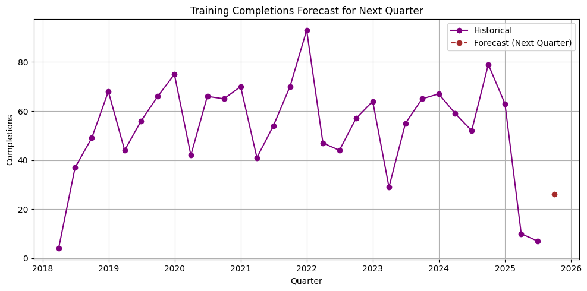
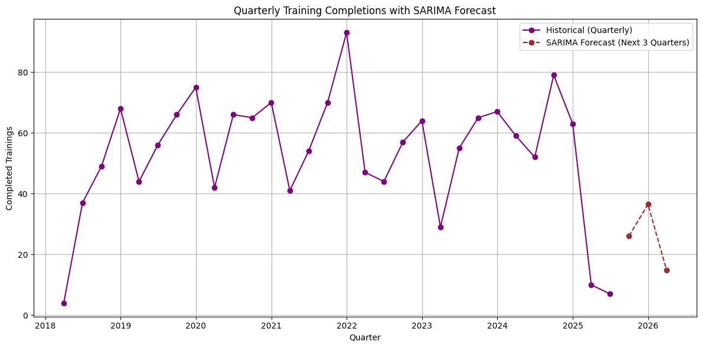

# RCHG LMS Analytics Project

## Project Overview
This project focuses on cleaning and preparing an LMS dataset enriched with employee information, and building **Power BI and Tableau dashboards** to analyse compliance, training performance, and engagement patterns.

---

## 1. Data Cleaning and Preparation Report

### **Project Objective**
Prepare a clean, standardised LMS dataset enriched with employee details, ready for Power BI dashboards and analytics.

---

### **Steps Taken**

#### **1. Data Integration**
- Combined the **LMS dataset** with **Employee Info** using `EmployeeID` as the key.
- Added `JoinedDate` from Employee Info and placed it next to `EnrollmentDate` for logical flow.

#### **2. Data Cleaning**
- **Verified Binary Columns**:
  - Columns like `IsMandatory` and `Overdue` checked for valid values (**Yes/No**).
  - Corrected **15 misclassified entries** to `No`.
- **Standardized Column Names**:
  - Removed spaces and replaced them with underscores for compatibility.
  - Example: `Course Title → Course_Title`.
- **Removed Duplicates**:
  - Eliminated duplicate rows to maintain data integrity.

#### **3. Date Standardisation**
- Converted all relevant columns to `datetime` format:
  - `EnrollmentDate`, `CompletionDate`, `LastAccessDate`, `JoinedDate`.
- Applied consistent **DD-MM-YYYY** format.

#### **4. Derived Metrics and Flags**
- Added **calculated columns**:
  - `DaysSpent = CompletionDate − EnrollmentDate`
  - `Enroll_minus_Join = EnrollmentDate − JoinedDate`  
    → Positive = OK, Negative = Anomaly.
  - `Days_LastAccess_vs_Completion = LastAccessDate − CompletionDate`.
- **Flags Added**:
  - `CourseBeforeEmployee` = TRUE if enrollment occurred before joining.

#### **5. Validation and Export**
- Verified cleaned data for anomalies.
- Exported final datasets for Power BI:
  - `Final_Enriched_LMS_Dataset.xlsx`
  - `Cleaned_RCHG_LMS_Dataset_For_PowerBI.xlsx`

#### **6. Notebook Automation**
- Developed a **Google Colab script**:
  - Mount Google Drive & import libraries (pandas, numpy, openpyxl).
  - Load dataset → Remove duplicates → Standardize names.
  - Export cleaned dataset for Power BI.

---

### **Summary of Key Changes**
✔ Binary fields standardized (**Yes/No**)  
✔ 15 incorrect entries corrected  
✔ Added metrics for course duration and anomalies  
✔ Flags for employees enrolled before joining  
✔ Exported Power BI-ready Excel files  

---

## 2. Dashboard Components

This project uses a Star Schema data model to support scalable, flexible, and performant analytics within Power BI. At the center of the model lies the fact_training table, surrounded by well-structured dimension tables that enrich the context of training activities.

### Fact Table

**fact_training** : Captures detailed training records, including completions, feedback ratings, course metadata, skill scores, and accessibility indicators.

### Dimension Tables

**dim_employee** : Contains employee metadata such as role, location, join date, and a foreign key to dim_team.

**dim_team** : Stores unique team names and IDs, supporting hierarchical filtering and drilldown.

**dim_course** : Provides information about course titles, categories, and providers.

**dim_date** : A classic date dimension enabling time-series analytics across enrollment, completion, and access dates.

### Relationships

- fact_training[EmployeeID] → dim_employee[EmployeeID]

- fact_training[CourseID] → dim_course[CourseID]

- fact_training[CompletionDate], EnrollmentDate, LastAccessDate → dim_date[Date]

- dim_employee[TeamID] → dim_team[TeamID]

All relationships follow a one-to-many structure (1:*), ensuring accurate filtering and slicing across all visuals and KPIs.

This layout enables multi-dimensional slicing across Role, Location, Team, Course Category, and Time.

Filters and slicers in the dashboard are sourced from dimension tables, ensuring clean propagation of filters to the fact_training table.

---

## 3. Dashboard Components
The dashboards are designed to provide insights into **Compliance & Training Summary**, **Performance Analysis**, and **Engagement Patterns**.

---

### **A. Compliance & Training Summary**
- **% of Completed Mandatory Courses**  
  → Breakdown by **team and role** with color-coded bars.  
  → Added **employee counts** for better context.

- **Overdue Training Trends**  
  → Monthly trends + Year-over-Year (YoY) view.  
  → Helps identify **seasonal peaks** in overdue training.

---

### **B. Performance Analysis**
- **SkillScore Distribution**  
  → Average ratings for **Communication**, **Teamwork**, and **Technical Efficiency** by **team** and **role**.  
  → Shows consistency in training quality and gaps across roles.

- **Flagged Skill Gaps**  
  → Stacked bars showing **Yes/No percentages**.  
  → Helps HR target **critical roles** with the highest skill gaps.

- **Average Review Score by Role and Team**  
  → Horizontal bar charts showing **mean scores**.  

---

### **C. Engagement Patterns**
- **Access Trends (Enrollment vs Last Access)**  
  → Dual-line chart comparing **enrollment vs last access activity** over time.  
  → Indicates drop-off rates and user engagement.

- **Device Usage Breakdown**  
  → Pie chart of access via **Desktop**, **Mobile**, and **Tablet**.

- **Time Spent on Courses**  
  → Average **course duration in minutes** by:
    - **Role**
    - **Location**

---

## Tools Used
- **Tableau Public** → Visualisation for trends and breakdowns.
- **Python (Pandas, NumPy)** → Data cleaning and automation.
- **Excel** → Data cleaning and transformation.
- **Google Colab** → Notebook-based pipeline for data prep.

## How to Use
1. Download the **cleaned dataset** from this repo.
2. Open the **Power BI report** or **Tableau workbook**.
3. Connect data → Explore dashboards.

---

## 4. LMS Dashboard Analysis

### Explore the Interactive Dashboards
All visualisations were built using **Tableau Public**.  
 [**Click here to view the full dashboards**](https://public.tableau.com/app/profile/juan.correa./viz/LMS-RychtenshaneCommunityHousingGroupRCHG/EngagementLearningBehaviourAnalysis)

---

## Overview
This project analyses **Learning Management System (LMS)** data to monitor training compliance, engagement patterns, and employee performance across teams and roles.

Dashboards were built using **Tableau Public** with data on enrollments, last access dates, skill scores, and device usage.

---

## Key Dashboards & Insights

### 1. Compliance & Training Summary
- **% of Completed Mandatory Courses by Team**
  - IT: **82.79%**
  - Facilities: **81.52%**
  - Repairs: **79.55%**
- **Overdue Training Trends**
  - Peak overdue: **62 employees in 2022**
  - Monthly highest overdue: **June with 9 overdue courses**
    

> **Note:** Even after creating new aggregated columns in Python and Excel during earlier steps, we decided to compute the **Completed and Mandatory** ratio directly in Tableau. This approach was chosen for the quicker calculation of the indicator by leveraging Tableau’s native aggregation, rather than relying on pre-processed data.

  
### 2. Performance Analysis
- **SkillScore Distribution** (Scale: 1–5)
  - Communication: Facilities highest (**3.11**), Housing lowest (**2.92**)
  - Teamwork: IT highest (**3.05**)
  - Tech Efficiency: Finance highest (**3.16**)
- **Skill Gaps**
  - IT team has the highest flagged gaps (**17.55%**)
- **Average Review Scores**
  - Highest: Electrician (**81.83**)
  - Lowest: Plumber (**78.82**)
    

### 3. Engagement Patterns
- **Access Trends (Enrollment vs Last Access)**
  - Enrollment peak: **189 in 2024**
  - Last Access peak: **179 in 2024**
- **Device Usage Breakdown**
  - Desktop: **56.11%**
  - Mobile: **51.93%**
  - Tablet: **51.83%**
- **Time Spent on Courses**
  - By Role:
    - Lettings Coordinator: **78 mins**
    - Plumber: **70.2 mins**
  - By Location:
    - Northfield Office: **76.4 mins**

---

### 4. Statistical Insights

To extract meaningful insights from the training and performance data, we applied the following statistical techniques
Each technique was selected to answer a specific business question using the most statistically appropriate and interpretable method.

- **Forecasting: Predicting Training Completions using SARIMA:**
**Purpose**: To forecast future training completions based on historical seasonal patterns.  
**Justification**: The data exhibits quarterly seasonality. SARIMA (Seasonal ARIMA) is well-suited for modeling and predicting time series data with trend and seasonal components.

  - **Next Quarter Forecast** (Q3 2025):
    - **26.07** completions are expected.
    - This reflects a noticeable drop compared to prior quarters, possibly indicating decreased engagement or seasonal dips.

  - **Next 3 Quarters Forecast**:
    | Quarter       | Forecasted Completions |
    |---------------|------------------------|
    | Q3 2025       | 26.07                  |
    | Q4 2025       | 36.49                  |
    | Q1 2026       | 14.85                  |
  
  The downward trend after Q4 2025 may warrant proactive measures to re-engage learners or investigate training availability.
  
  **SARIMA Forecast for Next Quarter**  

**SARIMA Forecast for Next 3 Quarters**  

- **Regression Analysis: Impact of Training Duration and Frequency on Performance:**
**Purpose**: To quantify the relationship between training attributes (duration and frequency) and employee performance scores.  
**Justification**: Linear regression allows us to model the **magnitude and direction of influence** each factor has on performance, and is ideal when predicting a continuous outcome based on numeric predictors.

  - **Intercept**: `2.98` (baseline performance score)
  - **Duration Coefficient**: `+0.0006`
  - **Course Frequency Coefficient**: `-0.0209`

  - **Interpretation:**
  - **Training Duration**:
    > Every additional minute of training increases the performance score by 0.0006 points. This suggests that longer training sessions have a positive, though modest, impact on performance.
  - **Course Frequency**:
    > Surprisingly, each additional course completed decreases performance by 0.0209 points, indicating a possible effect of overtraining, burnout, or redundant content.
  
  **Recommendation**: Focus on improving the quality and relevance of courses rather than increasing volume.

- **ANOVA: Comparing Performance Across Departments:**
**Purpose**: To test whether there are statistically significant differences in average performance scores across multiple departments (teams).  
**Justification**: ANOVA is the standard statistical method for comparing means across more than two independent groups, making it suitable for assessing inter-departmental disparities.

  - **F-statistic**: `0.5622`
  - **P-value**: `0.7290`

> There is **no statistically significant difference** in performance scores across teams.  
This suggests a consistent performance level across departments, with no particular team outperforming or underperforming significantly.

## Summary

- Forecasting helps identify **seasonal patterns** and anticipate future participation.
- Regression reveals that **longer training helps**, but **course overload can hurt performance**.
- ANOVA confirms **uniform skill performance across teams**, supporting fairness and consistent training delivery.

---
### 5. Accessibility Overview

### **Performance of Users Who Accessed Training with a Screen Reader**
- **Average Score (Yes): 81.08**
- **Average Score (No): 80.15**
- **Distinct Employees:**
  - Screen Reader Users: **210**
  - Non-Screen Reader Users: **761**
- **Insight:** Employees using screen readers perform slightly better than those who do not, indicating accessibility support does **not hinder learning outcomes**.

---

### **Feedback Scores vs. Accessibility Usage**
- **Average Feedback (Yes): 3.8**
- **Average Feedback (No): 4.1**
- **Observation:** Screen reader users provided slightly lower feedback, which may suggest improvements are needed for the accessibility experience.

---

### **Feedback Scores vs. Accessibility Usage – Detailed Analysis**
- **Avg Feedback Rating Scale:** 1 to 5 *(1 = Poor, 5 = Excellent)*
- **Results:**
  - Screen Reader Users (Yes): **3.18**
  - Non-Users (No): **3.16**

**Interpretation:**
- Both groups rate training almost equally, indicating **similar satisfaction levels**.
- The slight difference (3.18 vs 3.16) is **statistically negligible**, meaning accessibility support does **not negatively impact user experience**.
- Since the scale is **1–5**, these values show an **average experience**, signaling possible **improvement opportunities** in course design for all users.

## Tech Stack
- **Visualization Tool:** Tableau Public
- **Dataset:** LMS Employee Training Data
- **Data Cleaning & Prep:** Excel/Python

## 📂 Additional Files
- [`LMS.Dashboard.Report.zip`](https://github.com/user-attachments/files/21456474/LMS.Dashboard.Report.zip) – **Additional support documentation**, including the full dashboard report and related resources.

---

### 🔗 Reminder: Explore Full Interactive Dashboards
All insights and visualizations are available in the interactive Tableau dashboard:  
👉 [**Click here to view the complete dashboards**](https://public.tableau.com/app/profile/juan.correa./viz/LMS-RychtenshaneCommunityHousingGroupRCHG/EngagementLearningBehaviourAnalysis)

---

